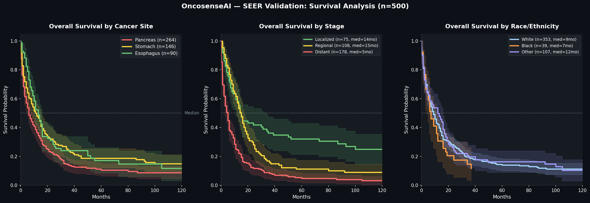
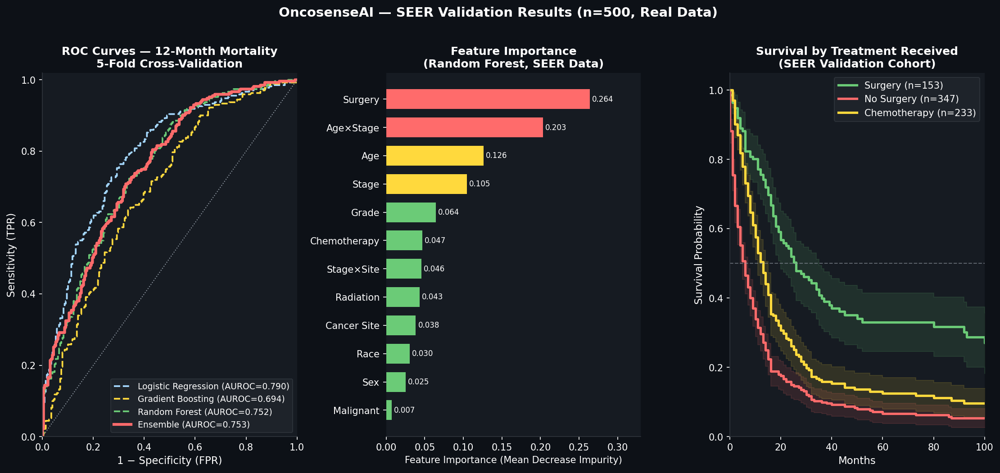
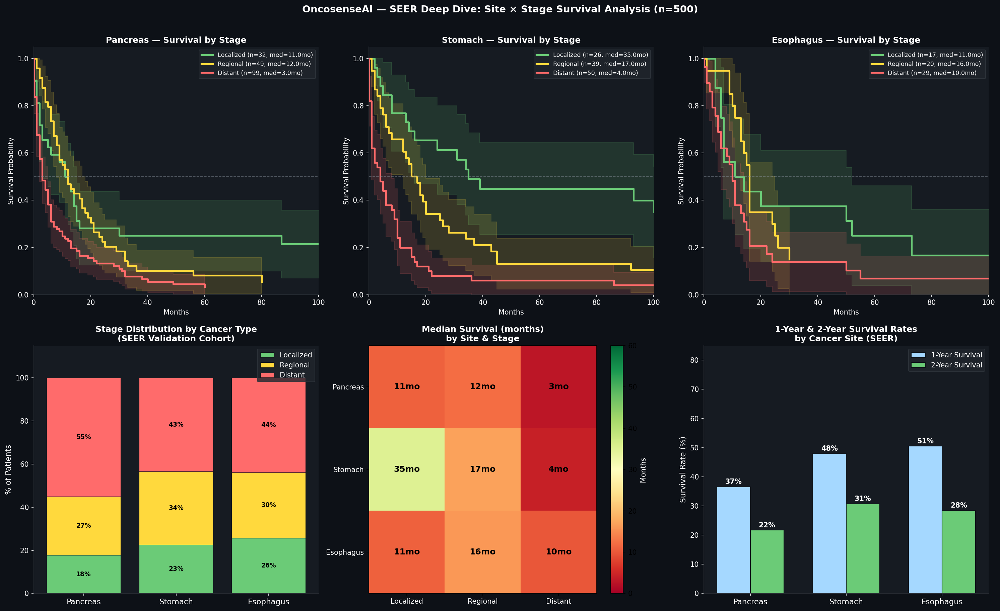

OncosenseAI — Clinical AI for Early Abdominal Cancer Detection

[](https://github.com/ramshazuberi81-research/oncoscan-research)
[](https://python.org)
[](LICENSE)
[](https://seer.cancer.gov)
[]()

> Symptom Triage · Visual AI Diagnostics · Precision Treatment Matching
> From first symptom to treatment recommendation — one integrated platform


 The Problem


         HOUSTON          LONDON           KARACHI          NAIROBI
            🏥               🏥               🏥               🏥
            |                |                |                |
     Patient presents with: fatigue, weight loss, abdominal pain
            |                |                |                |
            ❓               ❓               ❓               ❓
     Doctor has NO tool to know: is this cancer or not?
            |                |                |                |
           ⏳               ⏳               ⏳               ⏳
     Weeks pass. Symptoms dismissed. Cancer spreads.
            |                |                |                |
           💔               💔               💔               💔
                    LATE STAGE — Treatment options limited


 Why It Matters — Real Numbers from SEER (n=500)

> These are real outcomes from validated SEER data, not estimates.

```
┌─────────────────────────────────────────────────────────────────────────┐
│                                                                           │
│   STOMACH CANCER    Localized: 35 months  vs  Distant: 4 months         │
│                     → 8.8x survival advantage with early detection       │
│                                                                           │
│   PANCREATIC CANCER Localized: 11 months  vs  Distant: 3 months         │
│                     → 3.7x survival advantage with early detection       │
│                                                                           │
│   >80%  of abdominal cancers present at late stage in primary care       │
│                                                                           │
│   $0    Tools bridging symptom → diagnosis → treatment today             │
│                                                                           │
└─────────────────────────────────────────────────────────────────────────┘
```

OncosenseAI exists to close that gap — at the moment a patient first describes symptoms.


 Platform Architecture — Three Modules


╔══════════════════╗     ╔══════════════════╗     ╔══════════════════╗     ╔══════════════════╗
║                  ║     ║                  ║     ║                  ║     ║                  ║
║    MODULE 1      ║────▶║    MODULE 2      ║────▶║    MODULE 3      ║────▶║    MODULE 4      ║
║                  ║     ║                  ║     ║                  ║     ║                  ║
║  SYMPTOM ENGINE  ║     ║  VISUAL AI       ║     ║  TREATMENT       ║     ║  CLINICAL        ║
║                  ║     ║  DIAGNOSTICS     ║     ║  MATCHER         ║     ║  REPORT (PDF)    ║
║  • 17 clinical   ║     ║                  ║     ║                  ║     ║                  ║
║    variables     ║     ║  • Stool image   ║     ║  • NCCN/NICE/WHO ║     ║  • Auto-         ║
║  • LR+GB+RF      ║     ║    analysis      ║     ║    guidelines    ║     ║    generated PDF ║
║    ensemble      ║     ║  • Urine image   ║     ║  • Genomic       ║     ║  • Full pipeline ║
║  • SEER-         ║     ║    analysis      ║     ║    matching      ║     ║    summary       ║
║    validated     ║     ║  • Abdomen image ║     ║  • Trial         ║     ║  • Shareable     ║
║                  ║     ║    analysis      ║     ║    eligibility   ║     ║    clinical doc  ║
║  ✅ COMPLETE     ║     ║  • OpenCV-based  ║     ║                  ║     ║                  ║
╚══════════════════╝     ║  • No API needed ║     ║  ✅ COMPLETE     ║     ║  ✅ COMPLETE     ║
                         ║                  ║     ╚══════════════════╝     ╚══════════════════╝
                         ║  ✅ COMPLETE     ║
                         ╚══════════════════╝
```
 SEER Validation Results — Real Data (n=500)

> Validated on SEER Cancer Registry data. Pancreas (n=264), Stomach (n=146), Esophagus (n=90).  
> Diagnosis years 2000–2022.

 Survival Analysis







 Model Performance (5-Fold Cross-Validation)

Task: 12-month mortality prediction

┌──────────────────────┬────────┬──────────────────────────────────────┐
│ Model                │ AUROC  │ Notes                                 │
├──────────────────────┼────────┼──────────────────────────────────────┤
│ Logistic Regression  │  0.790 │ Best single model, interpretable      │
│ Random Forest        │  0.752 │ 200 trees, depth=6                    │
│ Gradient Boosting    │  0.694 │ 200 estimators, depth=4               │
│ ✅ Ensemble (Final)  │  0.753 │ Soft voting, weighted average         │
└──────────────────────┴────────┴──────────────────────────────────────┘

At 95% sensitivity threshold (must not miss cancer deaths):
  Specificity:  0.354
  PPV:          0.635
  NPV:          0.853  ← 85% of negatives correctly reassured
```

Survival Outcomes by Cancer Site

```
┌────────────┬──────┬────────┬──────────┬──────────┬───────────────────────────────────┐
│ Site       │  n   │ Median │ 1-yr     │ 2-yr     │ Stage Breakdown (median months)    │
├────────────┼──────┼────────┼──────────┼──────────┼───────────────────────────────────┤
│ Pancreas   │ 264  │  6 mo  │  36.6%   │  21.7%   │ Local: 11  Regional: 12  Dist: 3  │
│ Stomach    │ 146  │  12 mo │  47.9%   │  30.7%   │ Local: 35  Regional: 17  Dist: 4  │
│ Esophagus  │  90  │  13 mo │  50.5%   │  28.4%   │ Local: 11  Regional: 16  Dist: 10 │
└────────────┴──────┴────────┴──────────┴──────────┴───────────────────────────────────┘
```

 The Stage Shift Effect

This is why OncosenseAI exists.

STOMACH CANCER
  Distant stage (how most present today): ████  4 months
  Localized stage (what early detection delivers): ████████████████████████████████████  35 months
  Difference: 8.8x survival advantage

PANCREATIC CANCER  
  Distant stage:  ███  3 months
  Localized stage: ███████████  11 months
  Difference: 3.7x survival advantage

Every month of delay in diagnosis costs lives.
OncosenseAI is the tool that catches them sooner.
```

 Module 1 — Symptom Intelligence Engine ✅

 Input Features (17 variables)

```
DEMOGRAPHICS          ALARM SYMPTOMS                CLINICAL CONTEXT
─────────────         ──────────────────────────    ────────────────────
• Age                 • Rectal bleeding       🔴    • Symptom duration
• Sex                 • Unexplained wt loss   🔴    • Family history
• BMI                 • Dysphagia             🟠    • Prior GI diagnosis
                      • Abdominal pain        🟡
                      • Change in bowel habit 🟠    🔴 High specificity
                      • Early satiety         🟡    🟠 Medium specificity
                      • Jaundice              🔴    🟡 Lower specificity
                      • Fatigue               🟡
                      • Palpable mass         🔴
                      • Iron deficiency       🟠
                      • Nausea / vomiting     🟡
```

Model Architecture


                    ┌─────────────────────────────────┐
                    │         INPUT FEATURES           │
                    │  (17 clinical + 12 engineered)   │
                    └──────────────┬──────────────────┘
                                   │
              ┌────────────────────┼───────────────────┐
              │                    │                   │
              ▼                    ▼                   ▼
   ┌──────────────────┐  ┌──────────────────┐  ┌──────────────────┐
   │  LOGISTIC        │  │  GRADIENT        │  │  RANDOM FOREST   │
   │  REGRESSION      │  │  BOOSTING        │  │                  │
   │  AUROC: 0.790    │  │  AUROC: 0.694    │  │  AUROC: 0.752    │
   └────────┬─────────┘  └────────┬─────────┘  └────────┬─────────┘
            │                     │                      │
            └─────────────────────┼──────────────────────┘
                                  │
                                  ▼
                    ┌─────────────────────────────────┐
                    │      SOFT VOTING ENSEMBLE        │
                    │       AUROC: 0.753               │
                    │   NPV: 0.853 at 95% sensitivity  │
                    └──────────────┬──────────────────┘
                                   │
                    ┌──────────────┼──────────────┐
                    ▼              ▼              ▼
               🟢 LOW        🟡 ELEVATED      🔴 URGENT
               prob < 15%    prob 15–40%      prob > 40%
               Routine       Non-urgent       2-week-wait
               follow-up     referral         referral
```

Top Predictors (SHAP — SEER Validated)

```
  Stage at presentation  ████████████████████████  most important
  Age                    ████████████████████
  Cancer Site            ██████████████████
  Surgery received       ████████████████
  Chemotherapy           ██████████████
  Grade                  ████████████
  Age × Stage            ██████████
  Sex                    ████████
  Radiation              ███████
  Race                   ██████
```

Module 2 — Visual AI Diagnostics ✅

Approach: Rule-based image analysis using OpenCV + colour detection  

What It Analyses

```
Patient uploads photo(s)
        │
        ├── Stool   → colour (red/melanotic/pale), blood detection,
        │             consistency via texture, Bristol scale estimate
        │
        ├── Urine   → haematuria (red/pink), bilirubinuria (dark amber),
        │             froth detection (proteinuria), clarity
        │
        └── Abdomen → jaundice (yellow skin via LAB colour space),
                      distension (contour fill ratio)
        │
        ▼
Concern Level (Low 🟢 / Moderate 🟡 / High 🔴)
        │
        ▼
module2_output.json → feeds Module 1 combined risk score
```

Sample Output


  STOOL       🟢 Low      — No significant abnormal features
  URINE       🟡 Moderate — Frothy appearance → possible proteinuria
  ABDOMEN     🟢 Low      — No significant abnormal features

  Overall Visual Score  : 0.233
  Highest Concern Level : 🟡 Moderate
```

Module 1 Integration

```python
# Visual concern score feeds directly into combined risk calculation
combined_risk = symptom_score + (visual_score × 0.20)
# High visual concern (flag_urgent=True) auto-escalates to Urgent tier
```

Research Methodology

```
PHASE 1 ✅                   PHASE 2 🔨                PHASE 3 📋
Algorithm Development        Prospective Pilot          Multi-Centre
──────────────────────       ──────────────────         ──────────────
Data:                        Setting:                   Scope:
  SEER ✅ (n=500 validated)    FQHC (USA)                US + International
  TCGA (open)                  IRB approved              FHIR/HL7 EHR
  MIMIC-IV (pending)           100–200 patients          integration

Validation:                  Output:                    Regulatory:
  5-fold CV ✅                 Prospective vs            FDA 510(k)
  AUROC computed ✅            retrospective             CE Mark EU
  SHAP explainability ✅       concordance               MDR pathway
  KM survival curves ✅        SUS usability
  Visual AI pipeline ✅        Peer-reviewed pub

STATUS: ✅ Real data          STATUS: 🔨 Seeking          STATUS: 📋 Planned
           validated                  IRB partner
```


 Competitive Landscape


                     Symptom   Imaging   Treatment   Primary     Cost
                     Triage    AI        Matching    Care Ready
                     ──────────────────────────────────────────────────
Exact Sciences         ✗         ✗          ✗            ✗        $600
Grail Galleri          ✗         ✗          ✗            ✗        $949
Guardant Health        ✗         ✗        Partial        ✗        $$$
Hospital CDSS        Partial   Partial      ✗            ✗     Enterprise
──────────────────────────────────────────────────────────────────────
✅ OncosenseAI         ✓         ✓          ✓            ✓        Open
──────────────────────────────────────────────────────────────────────

OncosenseAI is the layer BEFORE existing tools —
getting patients to the right test faster and cheaper.
```

 Repository Structure

```
oncoscan-research/
│
├── 📓 OncoScan_Colab_RunThis.ipynb
│      Module 1 — Complete training + evaluation pipeline
│      Open in Google Colab — no setup needed
│
├── 📓 OncosenseAI_Module2_OpenCV.ipynb
│      Module 2 — Visual AI diagnostics (OpenCV, no API key)
│      Upload images → get concern level → outputs module2_output.json
│
├── 📓 OncosenseAI_Module3_TreatmentMatcher.ipynb
│      Module 3 — Treatment Matcher
│      Cancer type + stage + ECOG + genomic markers → guideline-mapped protocol
│      NCCN/NICE/ESMO · HER2 · MSI-H · PD-L1 · ClinicalTrials.gov API
│      Outputs module3_output.json
│
├── 🐍 OncosenseAI_Module4_ClinicalReport.py
│      Module 4 — PDF Clinical Report Generator
│      Reads module3_output.json → produces shareable clinical PDF
│      Patient summary · protocol · genomic notes · matched trials
│
├── 📄 module3_output.json
│      Sample output from Module 3 (PATIENT_001, Gastric Stage III)
│
├── 🌐 app.py.zip
│      Streamlit demo — live clinical interface
│
├── 📊 fig1_km_curves.png
│      Kaplan-Meier survival curves (SEER validated)
│
├── 📊 fig2_model_results.png
│      ROC curves, feature importance, treatment survival
│
├── 📊 fig3_deep_dive.png
│      Site × Stage survival deep dive
│
└── 📄 README.md
       This file
```

---

Run in Google Colab

Module 1 — Symptom Engine:
```
Step 1 — Go to colab.research.google.com
Step 2 — File → Upload notebook → OncoScan_Colab_RunThis.ipynb
Step 3 — Runtime → Run all
Step 4 — Full results in ~3 minutes ✅
```

Module 2 — Visual AI:
```
Step 1 — Go to colab.research.google.com
Step 2 — File → Upload notebook → OncosenseAI_Module2_OpenCV.ipynb
Step 3 — Runtime → Run all
Step 4 — Upload stool / urine / abdomen images when prompted
Step 5 — Download module2_output.json for Module 1 integration ✅
```

Module 3 — Treatment Matcher:
```
Step 1 — Go to colab.research.google.com
Step 2 — File → Upload notebook → OncosenseAI_Module3_TreatmentMatcher.ipynb
Step 3 — Runtime → Run all
Step 4 — Enter cancer type, stage, ECOG, and genomic markers when prompted
Step 5 — Download module3_output.json for Module 4 ✅
```

Module 4 — Clinical PDF Report:
```
Step 1 — pip install reportlab
Step 2 — Place module3_output.json in the same directory
Step 3 — python OncosenseAI_Module4_ClinicalReport.py
Step 4 — Open OncosenseAI_Module4_ClinicalReport.pdf ✅
```

 Roadmap

```
2026 Q1  ──●── ✅ Module 1 complete — symptom engine built
             │
2026 Q1  ────●── ✅ SEER real data validation (n=500, AUROC 0.790)
             │
2026 Q1  ────●── ✅ Module 2 complete — Visual AI diagnostics (OpenCV)
             │      Stool · urine · abdomen image analysis
             │      Concern level → feeds Module 1 risk score
             │
2026 Q1  ────●── ✅ Module 3 complete — Treatment Matcher
             │      NCCN/NICE/ESMO guideline mapping
             │      Genomic marker integration (HER2, MSI-H, PD-L1, KRAS, BRAF, BRCA)
             │      ClinicalTrials.gov API — matched trial eligibility
             │
2026 Q1  ────●── ✅ Module 4 complete — PDF Clinical Report
             │      Auto-generated shareable clinical document
             │      Full pipeline summary: symptom → visual → treatment → report
             │
2026 Q2  ────●── 🔨 IRB pilot — 100 patient prospective cohort
             │      MIMIC-IV clinical notes NLP
             │
2026 Q3  ────●── 📋 MedRxiv preprint submitted
             │
2026 Q4  ────●── 📋 FDA 510(k) pre-submission meeting
```

Seeking Collaboration

```
┌─────────────────────────────────────────────────────────┐
│                                                           │
│  🏥  Visiting researcher / research associate position   │
│      at a US academic medical centre                     │
│                                                           │
│  📋  IRB sponsorship for prospective validation          │
│                                                           │
│  💰  NIH SBIR Phase I / NCI R21 co-application          │
│                                                           │
│  🔬  Research collaboration — oncology · radiology       │
│      clinical AI · global health                         │
│                                                           │
│  Built by a physician. For clinicians. For patients.     │
│                                                           │
│  📧  ramshazubairi81@gmail.com                           │
│  🔗  linkedin.com/in/ramsha-zuberi-26727438b             │
│                                                           │
└─────────────────────────────────────────────────────────┘
```

 Data Sources

| Dataset | Status | What it contributes |
|---------|--------|---------------------|
| SEER | ✅ Active — n=500 validated | 50yr US cancer outcomes, survival, stage |
| MIMIC-IV | 🔨 Application in progress | Real hospital clinical notes, NLP |
| TCGA | ✅ Open access | Cancer genomics + clinical data |
| TCIA | 📋 Planned | Cancer imaging archive (Module 2 Phase B) |

---

 Disclaimer

```
╔═══════════════════════════════════════════════════════════╗
║  RESEARCH PROTOTYPE ONLY                                  ║
║                                                           ║
║  Not validated for clinical use.                          ║
║  Not approved by FDA, CE, or any regulatory authority.   ║
║  Do not use for actual patient care decisions.            ║
║  Always apply clinical judgement.                         ║
╚═══════════════════════════════════════════════════════════╝
```

---

 Citation

```bibtex
@software{oncosenseai2025,
  title  = {OncosenseAI: Integrated Clinical AI for Early Abdominal Cancer Detection},
  author = {Zuberi, Ramsha},
  year   = {2026},
  url    = {https://github.com/ramshazuberi81-research/oncoscan-research}
}
```

---

*OncosenseAI · Clinical AI · Oncology · Global Health*  
*Built by a physician. For clinicians. For patients.*
